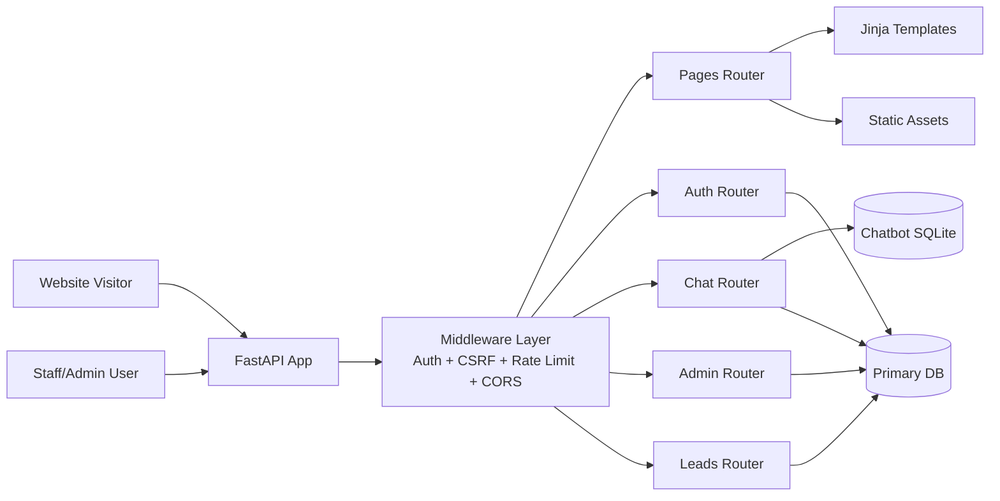
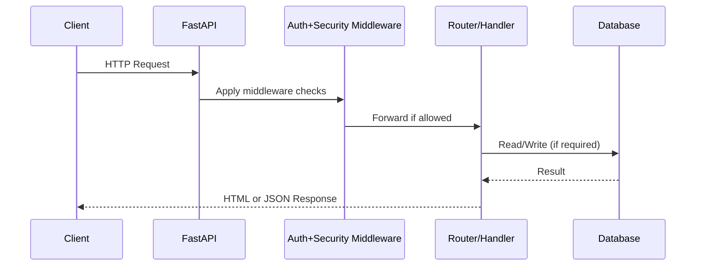
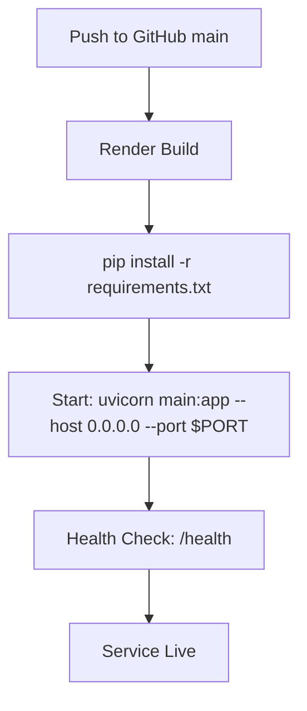

# COEPD AI Website

COEPD AI Website is a FastAPI-based web platform for Business Analyst program marketing, lead capture, chatbot conversations, and admin/staff lead operations.

It serves:
- Public marketing pages rendered with Jinja templates.
- Chatbot and enquiry endpoints for incoming leads.
- Admin/staff authentication with session and JWT support.
- Lead analytics and export endpoints for operations teams.

## Core Features

- Public landing site with static assets and component-based templates.
- AI chatbot flow with persisted chat/lead data.
- Lead capture APIs (`/lead`, `/contact`, `/enquiry`, `/leads`).
- Admin dashboard with filters, stats, CSV export, and staff management.
- Staff dashboard with paginated lead view.
- Authentication middleware with cookie-based auth + CSRF checks.
- Startup checks for missing dependencies, env configuration, and merge conflict markers.
- Render-ready deployment configuration.

## Architecture



## Request Flow (High Level)



## Tech Stack

- Python 3.11
- FastAPI + Uvicorn
- Jinja2 templates
- SQLAlchemy
- SQLite (chatbot + local fallback)
- Optional SQL Server via `pyodbc`
- HTML/CSS/JavaScript frontend assets

## Project Structure

```text
coepd-ai-website/
├─ app/
│  ├─ factory.py               # App creation, middleware, startup checks
│  ├─ auth.py                  # Token/session auth helpers
│  ├─ middleware/              # Auth/security + rate limiting
│  ├─ routers/                 # pages, auth, chat, admin, leads
│  ├─ services/                # lead service/business logic
│  ├─ database.py              # DB engine/session config
│  └─ db_models.py             # SQLAlchemy models
├─ chatbot/                    # Chatbot DB + related logic
├─ templates/                  # Jinja templates
├─ static/                     # CSS/JS/images/chatbot assets
├─ main.py                     # Entry point + analytics endpoints
├─ render.yaml                 # Render service config
└─ requirements.txt
```

## API and Page Endpoints (Summary)

Public pages:
- `GET /`
- `GET /privacy`
- `GET /health`

Authentication:
- `GET /staff`, `POST /staff`
- `GET /admin`, `POST /admin`
- `POST /api/login`
- `POST /api/admin/login`
- `POST /api/staff/login`
- `GET /auth/me`
- `GET /logout`, `POST /auth/logout`

Chat and lead capture:
- `POST /chat`
- `POST /lead`
- `POST /contact`
- `POST /enquiry`
- `POST /leads`

Admin APIs:
- `GET /admin/leads`
- `GET /admin/stats`
- `GET /admin/lead-growth`
- `GET /admin/source-breakdown`
- `GET /admin/export`
- Staff management routes under `/admin/staff...`

Analytics in `main.py`:
- `GET /api/domains`
- `GET /api/analytics/city-distribution`
- `GET /api/analytics/experience-distribution`
- `GET /api/analytics/top-industries`
- `GET /api/analytics/location-trends`
- `GET /api/analytics/experience-trends`
- `GET /api/analytics/domain-trends`

## Environment Variables

Create a `.env` file in project root.

Minimum recommended:

```env
JWT_SECRET_KEY=change-me
JWT_ALGORITHM=HS256
JWT_EXPIRE_HOURS=2
AUTH_COOKIE_SECURE=false
SESSION_SECRET_KEY=change-me
ADMIN_LOGIN_EMAIL=admin
ADMIN_LOGIN_PASSWORD=admin
```

Database options:
- Local/default SQLite is used when SQL Server is unavailable.
- For SQL Server, configure `MSSQL_DATABASE_URL` in SQLAlchemy format.

Render defaults from `render.yaml`:
- `PYTHON_VERSION=3.11.11`
- `SQLITE_DATABASE_PATH=/var/data/coepd_local.db`
- `DB_CONNECT_TIMEOUT_SECONDS=5`
- `DB_AVAILABILITY_CACHE_SECONDS=15`

## Local Development

1. Install dependencies:

```bash
pip install -r requirements.txt
```

2. Add `.env` values (see above).

3. Run app:

```bash
uvicorn main:app --host 0.0.0.0 --port 8000 --reload
```

4. Open:
- `http://localhost:8000/`
- `http://localhost:8000/health`

## Render Deployment

This repository includes `render.yaml` for one web service.



## Operations Notes

- If root (`/`) returns `{"error":"Service temporarily unavailable"}`, check logs for middleware-caught exceptions.
- Ensure `JWT_SECRET_KEY` is set in production.
- Keep `AUTH_COOKIE_SECURE=true` in HTTPS production environments.
- Verify persistent disk is mounted on Render for SQLite durability.

## Testing

Basic endpoint checks can be run using:

```bash
python test_endpoints.py
```

## Security Checklist

- Set strong `JWT_SECRET_KEY`.
- Use non-default admin credentials.
- Enable secure cookies in production.
- Restrict CORS origins for production instead of `*`.
- Rotate credentials periodically.

